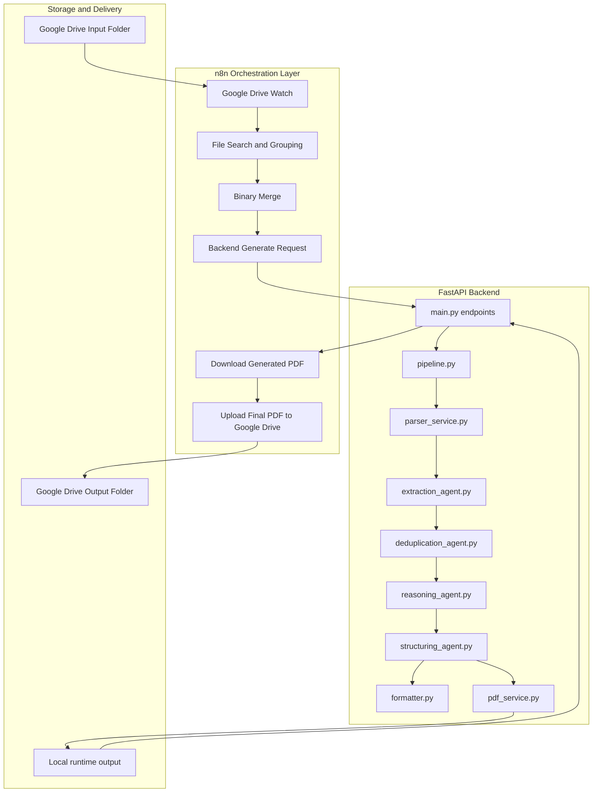

# AI DDR Report Generator

AI-powered Detailed Diagnosis Report (DDR) generation system for property health assessment.

This project combines:
- an `n8n` automation workflow for file orchestration
- a deployed FastAPI backend for extraction, reasoning, and report generation
- Google Drive as the input/output handoff layer

The system accepts:
- an Inspection Report PDF
- a Thermal Report PDF

and produces:
- a structured DDR JSON response
- a narrative markdown report
- a final generated PDF report

## Live Demo

- Live backend: [https://ai-ddr-report-generator-myce.onrender.com](https://ai-ddr-report-generator-myce.onrender.com)
- API docs: [https://ai-ddr-report-generator-myce.onrender.com/docs](https://ai-ddr-report-generator-myce.onrender.com/docs)
- Demo video: [OneDrive Demo Video](https://1drv.ms/v/c/a2184a82802a3233/IQB8NTywz-XuSJkur6M4Y6JGAR7Zt-uwa1MCX1SZOF2kRcE?e=8cpnk3)

## Test Folders

For testing the workflow:

- Upload source files to the input folder:
  [Google Drive Input Folder](https://drive.google.com/drive/folders/1m0IXmrsUcSW-P_xO6X3lb3PKIGXW7C1Y?usp=sharing)

- View generated reports in the output folder:
  [Google Drive Output Folder](https://drive.google.com/drive/folders/11KC3H_N24gvzZZKBIMXsUaoGTuII-twb?usp=sharing)

## Problem Statement

Manual property diagnosis reports are slow, repetitive, and error-prone when teams need to combine visual inspection findings with thermal evidence. Inspection PDFs usually contain:

- impacted areas
- positive-side and negative-side descriptions
- checklists for dampness, leakage, RCC condition, plaster, paint, plumbing, and external walls
- appendix photographs

Thermal reports add:

- thermal references
- hidden moisture indications
- hotspot and coldspot context

The objective of this project is to automatically generate a clean, accurate, client-friendly DDR that:

- extracts relevant observations from both reports
- links source-side defects to damage-side symptoms
- avoids duplicate points
- handles missing data explicitly
- includes relevant image references
- produces a final PDF ready for review

## What The Backend Does

The backend is the intelligence layer of the system.

At a high level, it:

1. receives the two report PDFs
2. parses the text page-by-page
3. renders page-level image references
4. extracts observations from:
   - impacted area mappings
   - summary tables
   - structural and checklist sections
5. deduplicates overlapping findings
6. reasons about:
   - probable root cause
   - severity
   - recommended actions
   - missing or unclear information
7. structures the final DDR
8. generates a final PDF report
9. exposes endpoints for report generation and download

## End-to-End Flow

1. User drops Inspection and Thermal PDFs into the Google Drive input folder.
2. `n8n` detects the new files.
3. `n8n` downloads the source PDFs.
4. `n8n` sends the PDFs to the deployed backend.
5. The backend parses, extracts, reasons, and generates the final DDR.
6. `n8n` downloads the generated PDF from the backend.
7. `n8n` uploads the final report PDF to the Google Drive output folder.
8. The generated report can then be reviewed, demonstrated, and later extended into approval/email workflows.

## System Design

```mermaid
flowchart LR
    A[User uploads Inspection PDF and Thermal PDF<br/>to Google Drive input folder]
    B[n8n Trigger / Folder Watch]
    C[Search and group client files]
    D[Download Inspection PDF]
    E[Download Thermal PDF]
    F[Rename binary fields for stable merge]
    G[Merge report files]
    H[FastAPI Backend<br/>/api/v1/ddr/generate-from-files]
    I[Parser Service<br/>text extraction + page image rendering]
    J[Extraction Layer<br/>impacted areas + summary table + checklist findings]
    K[Deduplication Layer]
    L[Reasoning Layer<br/>root cause + severity + therapies]
    M[Structuring Layer<br/>general info + narrative DDR]
    N[PDF Service<br/>final report generation]
    O[API response<br/>json + markdown + pdf_path]
    P[n8n downloads generated PDF<br/>/api/v1/ddr/report-file]
    Q[Google Drive Upload]
    R[Output folder with final report]

    A --> B
    B --> C
    C --> D
    C --> E
    D --> F
    E --> F
    F --> G
    G --> H
    H --> I
    I --> J
    J --> K
    K --> L
    L --> M
    M --> N
    N --> O
    O --> P
    P --> Q
    Q --> R
```



## Detailed Component View



## n8n Workflow

The workflow image is stored at `backend/output/workflow.png`.


Current high-level n8n workflow:

- trigger on file arrival
- search files and group by client
- download inspection and thermal PDFs
- rename binary fields
- merge the files
- call deployed backend
- download generated PDF
- upload generated PDF to Google Drive output folder

## API Endpoints

### Health

- `GET /health`

Returns:

```json
{
  "status": "ok"
}
```

### Generate report from uploaded PDFs

- `POST /api/v1/ddr/generate-from-files`

Form-data fields:

- `inspection_pdf`
- `thermal_pdf`

Returns:

- `structured_report`
- `markdown_report`
- `pdf_path`

### Generate report from raw structured content

- `POST /api/v1/ddr/generate-from-content`

Useful when documents are preprocessed externally.

### Generate report from local file paths

- `POST /api/v1/ddr/generate`

Useful for local backend-only testing.

### Download generated report PDF

- `GET /api/v1/ddr/report-file?name=final_report_cid01.pdf`

Used by `n8n` to fetch the generated report binary before uploading it to Google Drive.

### Approval package

- `POST /api/v1/ddr/approval-package`

Used to prepare manager/client email subject and body content for later approval automation.

## Report Structure

The generated DDR is designed to include:

1. General Information
2. Property Issue Summary
3. Area-wise and Structural Observations
4. Probable Root Cause
5. Dynamic Severity Assessment
6. Suggested Therapies and Recommended Actions
7. Limitations and Precaution Note
8. Missing or Unclear Information

The backend attempts to preserve:

- impacted area mapping
- positive-side / negative-side linkage
- structural checklist findings
- relevant thermal references
- relevant visual references
- explicit missing information markers

## Technology Stack

### Backend

- FastAPI
- Pydantic
- OpenAI API
- PyMuPDF
- pypdf
- ReportLab

### Orchestration

- n8n
- Google Drive nodes
- HTTP Request nodes

### Deployment

- Render

## Local Development

### Prerequisites

- Python 3.12
- OpenAI API key

### Environment variables

Copy `.env.example` to `.env` and configure:

```env
OPENAI_API_KEY=your_key_here
DDR_ENABLE_LLM=true
OPENAI_MODEL=gpt-5
```

### Install dependencies

```powershell
python -m pip install -r requirements.txt
```

### Run locally

```powershell
python -m uvicorn --app-dir . backend.main:app --host 0.0.0.0 --port 8000
```

### Local test URLs

- `http://127.0.0.1:8000/health`
- `http://127.0.0.1:8000/docs`

## Deployment

The backend is deployed on Render.

Deployment files included:

- `render.yaml`
- `.python-version`
- `requirements.txt`

Render start command:

```text
python -m uvicorn --app-dir . backend.main:app --host 0.0.0.0 --port $PORT
```

## Current Scope

Implemented:

- deployed FastAPI backend
- PDF ingestion and report generation
- extraction from summary mappings and checklist sections
- narrative DDR structuring
- PDF report generation
- Google Drive output upload through n8n

Planned next:

- manager approval email flow
- client email dispatch after approval
- stronger metadata extraction for client email and site details
- more persistent storage strategy beyond runtime-local PDF output

## Notes

- The current deployment is suitable for demo and workflow testing.
- Runtime-local generated files are intended to be downloaded immediately by `n8n` and moved to Google Drive.
- The final system should treat Google Drive or object storage as the durable output layer.

## Demo Submission Checklist

- Live deployed backend link included
- Demo video link included
- Input folder link included
- Output folder link included
- System design included
- Workflow image placeholder included
