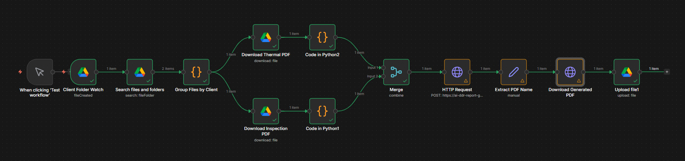
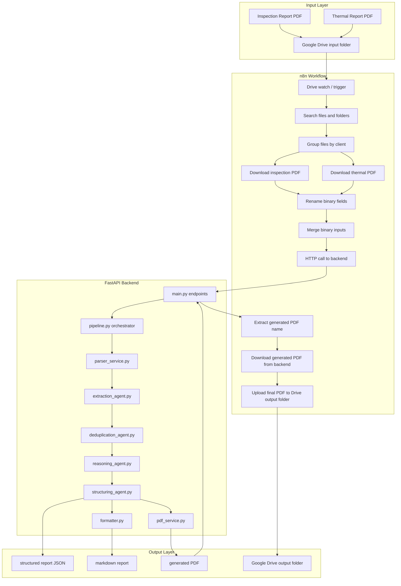

# AI DDR Report Generator



AI DDR Report Generator is an automated property health assessment system that converts an Inspection Report PDF and a Thermal Report PDF into a final Detailed Diagnosis Report (DDR).

The solution combines:
- `n8n` for orchestration
- a deployed FastAPI backend for parsing, extraction, reasoning, and report generation
- Google Drive for input and output file handling

It is designed to generate a cleaner, evidence-based, client-friendly report by connecting:
- impacted area / negative-side damage
- exposed area / positive-side defect
- supporting thermal references

## System Design

```mermaid
flowchart LR
    A[User uploads Inspection and Thermal PDFs<br/>to Google Drive input folder]
    B[n8n trigger]
    C[Search and group files by client]
    D[Download Inspection PDF]
    E[Download Thermal PDF]
    F[Rename binary fields]
    G[Merge both source PDFs]
    H[FastAPI backend<br/>generate-from-files]
    I[Parser service<br/>page text + page image references]
    J[Extraction layer<br/>summary tables + impacted areas + checklist findings]
    K[Deduplication layer]
    L[Reasoning layer<br/>root cause + severity + therapies]
    M[Structuring layer<br/>general info + narrative DDR]
    N[PDF generator]
    O[Backend response]
    P[n8n downloads generated PDF]
    Q[Google Drive upload]
    R[Google Drive output folder]

    A --> B
    B --> C
    C --> D
    C --> E
    D --> F
    E --> F
    F --> G
    G --> H
    H --> I
    I --> J
    J --> K
    K --> L
    L --> M
    M --> N
    N --> O
    O --> P
    P --> Q
    Q --> R
```



### Detailed Architecture



## Live Links

- Live backend: [https://ai-ddr-report-generator-myce.onrender.com](https://ai-ddr-report-generator-myce.onrender.com)
- API docs: [https://ai-ddr-report-generator-myce.onrender.com/docs](https://ai-ddr-report-generator-myce.onrender.com/docs)
- Demo video: [OneDrive Demo Video](https://1drv.ms/v/c/a2184a82802a3233/IQB8NTywz-XuSJkur6M4Y6JGAR7Zt-uwa1MCX1SZOF2kRcE?e=8cpnk3)

## Test Links

- Input folder:
  [Google Drive Input Folder](https://drive.google.com/drive/folders/1m0IXmrsUcSW-P_xO6X3lb3PKIGXW7C1Y?usp=sharing)

- Output folder:
  [Google Drive Output Folder](https://drive.google.com/drive/folders/11KC3H_N24gvzZZKBIMXsUaoGTuII-twb?usp=sharing)

## What the Backend Does

The backend is the core intelligence layer.

It:

1. receives inspection and thermal PDFs
2. extracts text from each page
3. renders page-level image references
4. extracts observations from:
   - impacted areas
   - summary tables
   - positive-side and negative-side mappings
   - structural checklists such as RCC, external walls, plaster, and paint
5. deduplicates overlapping findings
6. reasons about:
   - probable root cause
   - severity
   - recommended actions
   - missing or unclear information
7. structures a narrative DDR
8. generates the final PDF report
9. exposes endpoints for report generation and report download

## End-to-End Workflow

1. Upload Inspection and Thermal PDFs into the Google Drive input folder.
2. `n8n` detects the new files.
3. `n8n` downloads the source PDFs.
4. `n8n` calls the deployed backend.
5. The backend parses, extracts, reasons, and generates the final DDR.
6. `n8n` downloads the generated PDF from the backend.
7. `n8n` uploads the final PDF to the Google Drive output folder.

## API Endpoints

### Health

- `GET /health`

### Generate report from uploaded PDFs

- `POST /api/v1/ddr/generate-from-files`

Form-data fields:
- `inspection_pdf`
- `thermal_pdf`

### Generate report from structured content

- `POST /api/v1/ddr/generate-from-content`

### Generate report from local file paths

- `POST /api/v1/ddr/generate`

### Download generated PDF

- `GET /api/v1/ddr/report-file?name=final_report_cid01.pdf`

### Approval package

- `POST /api/v1/ddr/approval-package`

## Run Locally

### Prerequisites

- Python 3.12
- OpenAI API key

### Environment

Copy `.env.example` to `.env` and configure:

```env
OPENAI_API_KEY=your_key_here
DDR_ENABLE_LLM=true
OPENAI_MODEL=gpt-5
```

### Install dependencies

```powershell
python -m pip install -r requirements.txt
```

### Start backend

```powershell
python -m uvicorn --app-dir . backend.main:app --host 0.0.0.0 --port 8000
```

### Local URLs

- `http://127.0.0.1:8000/health`
- `http://127.0.0.1:8000/docs`

## Deployment

The backend is deployed on Render.

Deployment files:
- `render.yaml`
- `.python-version`
- `requirements.txt`

Start command:

```text
python -m uvicorn --app-dir . backend.main:app --host 0.0.0.0 --port $PORT
```

## Tech Stack

### Backend

- FastAPI
- Pydantic
- OpenAI API
- PyMuPDF
- pypdf
- ReportLab

### Automation

- n8n
- Google Drive nodes
- HTTP Request nodes

### Deployment

- Render

## Current Scope

Implemented:
- deployed FastAPI backend
- file-based report generation from inspection and thermal PDFs
- narrative DDR generation
- PDF generation
- Google Drive output upload through n8n

Planned next:
- manager approval mail flow
- client mail after approval
- stronger metadata extraction for missing fields
- persistent storage strategy beyond runtime-local files

## Notes

- Runtime-local generated reports are intended to be downloaded immediately by `n8n`.
- Google Drive is currently used as the durable output layer.
- The workflow image should be stored at:
  [assets/workflow.png](assets/workflow.png)
